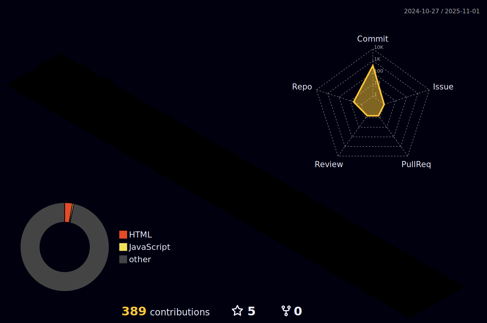

  

      
  

      
  
  
    &#8287;&#8287;&#8287;&#8287;&#8287;
  
    &#8287;&#8287;&#8287;&#8287;&#8287;
  
    &#8287;&#8287;&#8287;&#8287;&#8287;
  

 
<h3 align="center"> &nbsp;About me </h3>

   

 

&emsp;&emsp;:octocat: Hello, I'm CatZhang~

&emsp;&emsp;💯 Love computer science and inspire to become a senior programmer~

&emsp;&emsp;:thinking: We're making the world a better place, through constructing elegant hierarchies for maximum code reuse and extensibility~

&emsp;&emsp;🌠I don't like to write code, I just write the rules of survival in the future world~

  
 

  <h3> &nbsp; GitHub Analytics</h3>
  

 

  <a href="https://github.com/CrazyCatZhang">
     
     
   
   
  
   
   
<!--    -->
  </a>

 

  <h3>  &nbsp; Skills</h3>
  

   
  
  <h3>:fish_cake: Technology Stack</h3>
  
   
   
   
   
  
  <h3>:toolbox: Common Tools</h3>
   
   
  
  

 

  <h3>  &nbsp; Others</h3>
  

  <source media="(prefers-color-scheme: dark)" srcset="profile-snake-contrib/github-contribution-grid-snake-dark.svg" />
  <source media="(prefers-color-scheme: light)" srcset="profile-snake-contrib/github-contribution-grid-snake.svg" />
  
  
   
  
  

